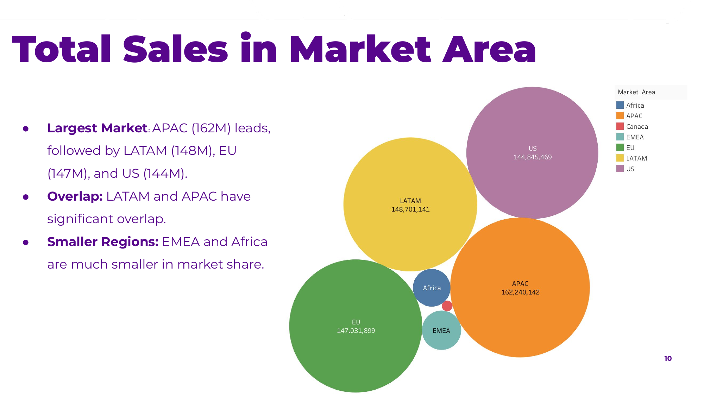
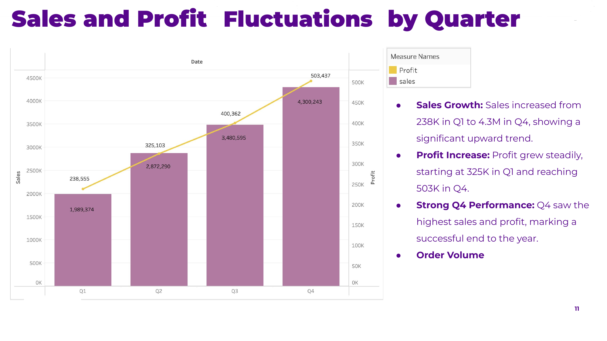
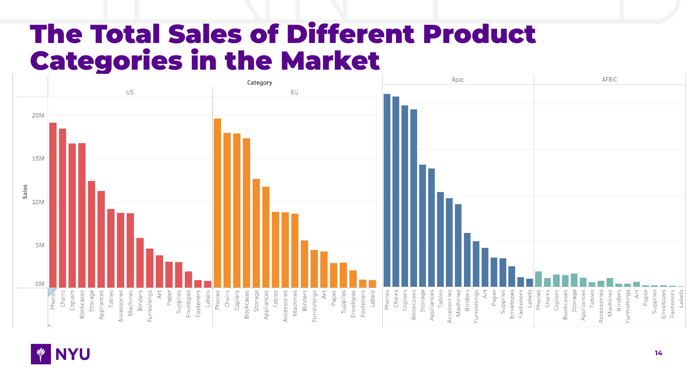
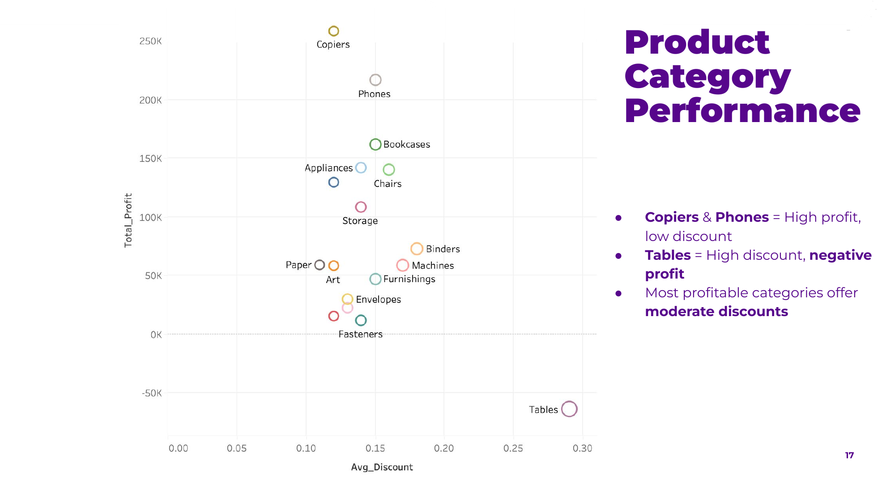
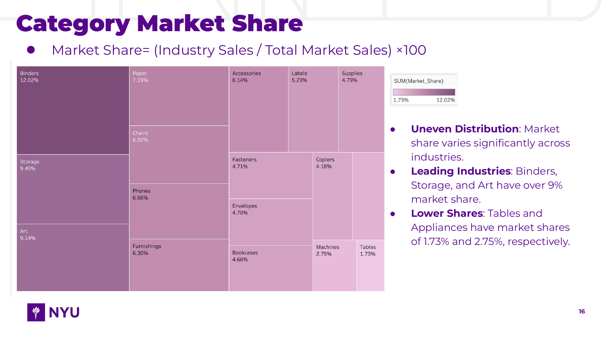
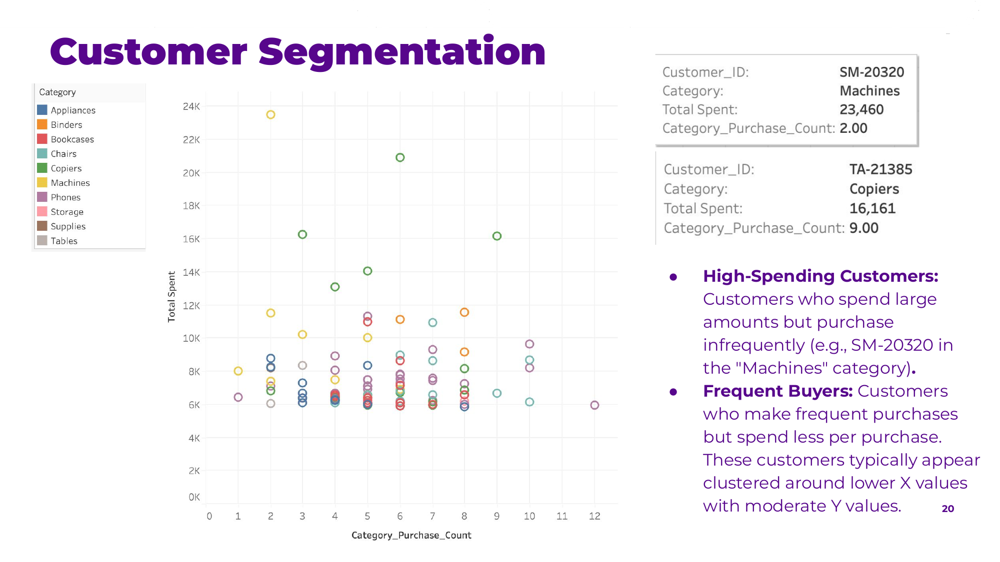

# Global Superstore: Sales, Category & Customer Analysis

**By Jade Wang** &nbsp;·&nbsp; SQL | Data Modeling | Tableau

I designed the relational data model, wrote the SQL analysis layer, and led the Overview, Category, and Customer Analysis modules for this project — analyzing 25,000+ global retail transactions to separate revenue performance from actual profitability.

---

## Business Context

Global Superstore is a simulated global retail dataset spanning **25,035 orders, 1,590 customers, and 10,768 products** across four market regions (US, EU, APAC, EMEA/Africa/LATAM). The goal was to move beyond descriptive reporting and answer three business-critical questions:

1. Where should the business concentrate regional investment?
2. Which product categories are actually profitable — not just high-revenue?
3. Which customers are at risk of churning, and what should the business do about it?

---

## Data Model

A normalized relational schema (11 tables) was designed to support order-, product-, and customer-level analysis — including surrogate keys, market/country hierarchies, and category dimensions. See [`data_model/ER_diagram.png`](./data_model/ER_diagram.png).

**Data preparation** included:
- Resolving 41,000+ missing postal codes
- Removing redundant/whitespace-corrupted columns (e.g. `Market_area`)
- Standardizing data types across 25K+ order records
- Engineering derived metrics: **Gross Profit Margin** and **Category Market Share**

---

## Key Findings

### 1. Regional Performance
APAC leads total sales ($162M), followed closely by LATAM, EU, and US — but EMEA and Africa remain significantly underpenetrated, representing potential whitespace for expansion.

### 2. Category Profitability ≠ Category Revenue
This is the most actionable finding in the project. **Tables** generate meaningful revenue but carry the **highest average discount (~28%) and a net negative profit margin** — while **Copiers and Phones** deliver strong profit at low discount levels. Revenue-only reporting would have missed this entirely; the analysis required joining discount, profit, and quantity together to expose it.

### 3. Customer Risk Identification
Built a SQL-based logic to flag customers with **no purchase activity in 180+ days** by category, surfacing reactivation targets for marketing. (Note: this is a rules-based inactivity flag, not a predictive ML model — see `python/` roadmap below if extended.)

### 4. Customer Segmentation
Identified two distinct behavioral segments: high-value/low-frequency buyers (e.g. large single purchases in Machines) vs. frequent/lower-basket-size buyers — useful for differentiated retention strategy (e.g. loyalty incentives vs. upsell campaigns).

---

## Data Visualization

| | |
|---|---|
|  |  |
|  |  |
|  |  |

Full set of dashboards (10 views covering regional, category, and customer analysis) available in [`/dashboard`](./dashboard).

---

## Business Recommendations

- **Cut or renegotiate discount strategy on Tables** — currently value-destructive at scale
- **Prioritize EMEA/Africa for growth investment** given low current penetration
- **Target the 180+ day inactive segment** with category-specific reactivation campaigns rather than blanket promotions
- **Double down on Q4 seasonal demand** — sales grew from $238K (Q1) to $4.3M (Q4)

---

## Repository Structure

```
├── README.md
├── index.html                     # Case study landing page
├── data_model/
│   └── ER_diagram.png
├── dashboard/
│   ├── 01_market_area_sales.png
│   ├── 02_quarterly_sales_profit.png
│   ├── 03_top_customers_state.png
│   ├── 04_category_sales.png
│   ├── 05_profit_margin_category.png
│   ├── 06_category_market_share.png
│   ├── 07_category_performance_scatter.png
│   ├── 08_customer_churn.png
│   ├── 09_customer_segmentation.png
│   └── 10_top_products.png
├── sql/
│   └── analysis_queries.sql       # views + queries: market sales, category margin,
│                                   # market share, churn flagging, segmentation
└── report/
    └── Global_Superstore_Report.pdf   # full original report
```

---

## Tools Used
`SQL (Oracle)` · `Tableau` · `ER/Data Modeling`

## My Contribution
Data model design, SQL view/query development (market sales, gross profit margin, category market share, customer inactivity logic, segmentation), and Tableau dashboards for Overview and Customer Analysis sections.

---
<sub>Team project. Contributors: Jennie Li, Sammi Jiang, Yuyuan (Jade) Wang.</sub>
